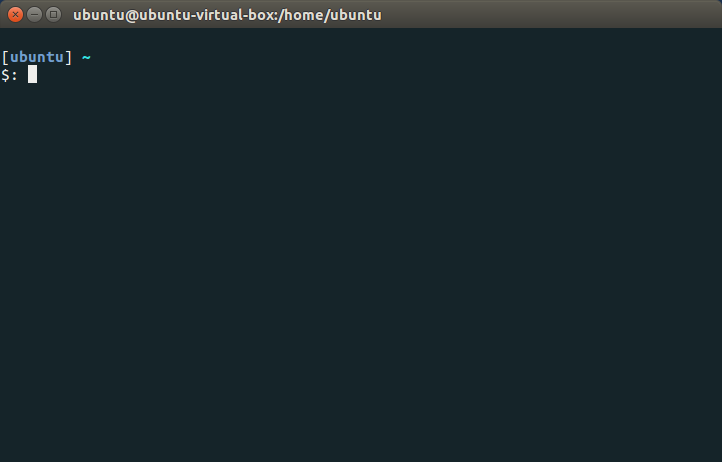

# PCS3616 - Laboratório 1 - Introdução ao UNIX 1

## Configuração da VM

Um dos objetivos práticos da disciplina é que você se familiarize com o
uso da linha de comando e com sistemas operacionais do tipo Unix, como o
Linux. Entre os diversos sistemas que serviriam para este propósito,
optamos por usar o [Ubuntu](http://www.ubuntu.com/), uma
distribuição de Linux completa e com uma interface muito amigável para
iniciantes.

Ao invés de instalar o Ubuntu diretamente nos computadores do
laboratório, ele será executado em uma máquina virtual (*virtual
machine*, ou VM), dentro do Windows. Desta forma, você também irá se
familiarizar com o conceito de **virtualização**, que será abordado nas
aulas teóricas.

Se você já usa Linux na sua máquina, pode utilizar ela mesma para o
laboratório, mas não nos responsabilizamos caso algum código não
funcione (com algum grau de certeza os programas vão rodar em qualquer
distribuição baseada em Debian).

O software de virtualização que iremos utilizar é o
[VirtualBox](https://www.virtualbox.org/), que você deve
instalar na sua máquina.

A primeira atividade desta aula é criar uma VM com o Ubuntu, seguindo os
passos abaixo.

1.  Instale o VirtualBox do site oficial.

2.  Baixe o arquivo "Ubuntu18-04-1_PCS3616.ova" [daqui](https://drive.google.com/file/d/1hlSvHk0TclyNkq1NoslMVsycU8VLinsO/view?usp=sharing).

3.  Abra o VirtualBox.

4.  Escolha File -\> Import Appliance .

5.  Encontre o .ova que você acabou de baixar e importe ele.

6.  Na tela seguinte (\"Appliance settings\"), altere as configurações a
    seguir (não é necessário alterar as que já estiverem com o valor
    correto), mas também não se sinta obrigado a nada, você é livre:

 |Configuração                       |Valor                             |
 |-----------------------------------|----------------------------------|
 |CPU                                |2                                 |
 |RAM                                |4096                              |

7.  Clique em Import para iniciar a importação. Após o término da
    importação, a VM deverá aparecer na tela principal do VirtualBox,
    com o status Powered Off.

8.  Apague o arquivo .ova usado para criar a VM antes que esqueçamos
    dele mais tarde.

9.  No VirtualBox, clique no nome da VM recém-criada para selecioná-la
    e, em seguida, clique em Start. Aguarde enquanto o sistema
    operacional é iniciado.

10. Faça login na VM com o usuário que já está selecionado (ubuntu). A
    senha, que será alterada depois, é pcs3616.

Se você desejar compartilhar um diretório entre a sua máquina e a VM, dê
uma olhada [neste tutorial](https://balbertini.github.io/vhdl_vmghdl-pt_BR.html)
do professor Bruno Albertini.

**Observação:** a partir de agora, que você já tem a VM, não vamos mais
usar o Windows. Por isso, você pode colocar a VM no modo \"tela cheia\"
(*full screen mode*), abrir o Moodle usando o Firefox que está instalado
dentro da VM e continuar de lá.

## Comandos Básicos

Aqui começa a primeira atividade entregável da aula.

**IMPORTANTE**: Este é um tutorial do tipo \"faça junto\" (*follow
along*). A nossa recomendação é que você mantenha a janela em que está
lendo este tutorial lado-a-lado com um terminal e vá executando os
comandos conforme eles forem apresentados. Esta é a melhor forma (e a
menos entediante!) de aprender a usar uma nova ferramenta.

Ao longo deste tutorial, você encontrará diversos exercícios. Para cada
exercício, você deverá criar um arquivo com o nome
{NÚMERO_DO_EXERCÍCIO}.out (por exemplo, 2_1.out).
No primeiro momento recomendamos criar todos os arquivos dentro de uma pasta,
ao final desse exercicio explicamos como cria-submeter os arquivos.

A figura abaixo mostra um programa em execução: o shell.



Talvez você já tenha ouvido falar do shell por algum outro nome, como:
interpretador de comandos, terminal, linha de comando, console ou TTY.
Além desses, o termo \"cmd\" também é comum para quem usa Windows.

A realidade é que cada um destes termos tem um significado diferente,
mas não iremos entrar em todos os detalhes agora.

O mínimo que você precisa saber é o seguinte: esta janela está
executando um programa genericamente chamado de **shell**. O shell é um
programa que, ao invés de possuir uma **interface gráfica** (isto é, com
botões, menus, janelas e que responde aos cliques do mouse), utiliza uma
**interface de texto**.

Quando o shell é iniciado, ele lê diversos arquivos de configuração para
carregar um ambiente de execução para o seu usuário e, em seguida, exibe
um **prompt** (também chamado de prompt de comando), que é algo parecido
com isso:

  ```bash
  $
  ```

Este prompt indica que o shell está pronto para receber comandos ou
instruções sobre o que fazer em seguida.

O prompt não precisa ser apenas o símbolo \$. A maioria dos shells
permite que você altere o prompt padrão para exibir outras informações
úteis ou para deixar o seu ambiente mais agradável visualmente. Alguns
exemplos de prompt personalizados são mostrados abaixo:

```bash
# Prompt de um usuário normal
$

# Prompt de um usuário administrador (também chamado de super-usuário,
# superuser ou root)
#

# Prompt com informações adicionais: nome do usuário logado (debora) e
# diretório atual de trabalho (~/Desktop)
debora: ~/Desktop $

# Prompt parecido com o anterior, mas adicionando o horário, o nome do
# computador (hostname) e caracteres de formatação
[ 14:24:12 debora@dell: ~/Desktop ] $
```

Para saber mais sobre como modificar o seu prompt, consulte a seção
[Recursos Adicionais](EXTRA.md).

Repare que, acima, mencionamos algo sobre \"a maioria dos shells\". Pois
é, não existe um único shell. No mundo *Unix-like* (sistemas
operacionais do tipo Unix), os mais comuns são o sh (Bourne shell), bash
(Bourne again shell), zsh (Z shell), ksh (Korn shell) e o fish (friendly
interactive shell). No Windows, os mais comuns são o cmd.exe e o
PowerShell.

Todos os shells de Unix possuem funcionalidades similares (mas não
necessariamente idênticas). No entanto, a sintaxe de cada pode ser muito
diferente da dos demais. Neste curso, vamos falar mais sobre o bash, que
é o shell utilizado por padrão no Linux.

Usando apenas o shell, você consegue fazer tudo que quiser no seu
computador, como:

-   criar arquivos e diretórios (pastas);
-   manipular arquivos e diretórios
(mover/apagar/renomear/editar/visualizar/criar atalhos);
-   instalar/remover/configurar programas;
-   criar/remover/editar usuários;
-   ler/enviar emails;
-   baixar arquivos da Internet;
-   acessar outros computadores remotamente; e
-   iniciar qualquer aplicação que possua uma interface gráfica
(Chrome, Firefox, LibreOffice, leitores de PDF, players de vídeo e música, jogos, etc).

Nesta seção, você irá aprender os comandos básicos para fazer algumas
destas coisas. A maioria dos comandos que serão apresentados existe em
qualquer sistema operacional do tipo Unix, o que inclui, por exemplo,
qualquer distribuição de Linux (como o Ubuntu, que vamos usar ao longo
da disciplina), CentOS, RHEL, FreeBSD, OpenBSD e Mac OS X.

### **Comandos de navegação: cd, pwd, caminhos absolutos e caminhos relativos**

pwd (**p**rint **w**orking **d**irectory): imprime o caminho do
diretório em que você se encontra.

```bash
# Imprime o diretório atual.
pwd
```

**Exercício 2.1:** execute o comando pwd no seu terminal e responda:
qual o seu diretório atual? (coloque a saída do comando no arquivo de
solução, por exemplo: /home/ubuntu/foo no arquivo 2_1.out).

cd (**c**hange **d**irectory): usado para ir até diretórios. Quando
executado sem argumentos, este comando leva você até o diretório do seu
usuário (sua *home*).

```bash
# Vai até o diretório do usuário.
cd
```

**Exercício 2.2:** execute o comando cd e, em seguida, execute novamente
pwd. Qual é o seu diretório agora?

**Observação**: O diretório *home* do usuário é comumente referenciado,
no shell, por \$HOME ou \~, como mostrado abaixo.

```bash
# Equivalente a executar apenas "cd".
cd $HOME
# ou
cd ~
```

Você também pode passar, como parâmetro para o cd, um **caminho
absoluto**. Caminhos absolutos são aqueles que começam com /.

```bash
# Vai para o diretório /var/log
cd /var/log

# Vai para o diretório /home/ubuntu/Desktop
cd /home/ubuntu/Desktop
```

O diretório-raiz do sistema de arquivos no Unix, isto é, o diretório de
nível mais alto, é o /, o que significa que o comando abaixo também é
valido:

```bash
# Vai para o diretório-raiz do sistema de arquivos.
cd /
```

Outra opção ainda é especificar um **caminho relativo**. Caminhos
relativos são concatenados com o seu diretório atual para formar o
caminho absoluto final que será considerado pelo comando.

```bash
# Vai para /home/ubuntu (caminho absoluto)
cd /home/ubuntu

# Vai para Desktop (caminho relativo). Como o diretório atual era
# /home/ubuntu (por causa do comando anterior), este comando irá levá-lo
# até o diretório /home/ubuntu/Desktop.
cd Desktop
```

Note que, até agora, estamos navegando sempre \"para baixo\" na árvore
de diretórios, isto é, entrando em subdiretórios. E se quisermos navegar
\"para cima\" nesta árvore, isto é, chegar em um diretório-pai a partir
de um diretório-filho?

Uma possível resposta é: sempre usar caminhos absolutos. Por exemplo,
suponha que o seu diretório atual é `/var/www/html`. Para chegar em
`/var/www` (diretório-pai), você poderia simplesmente fazer `cd /var/www`,
sem problemas. Mas existe outra alternativa: o uso dos **diretórios
especiais**.

Existem dois diretórios especiais, chamados `..` e `.`, que permitem que
você se refira ao diretório-pai do seu diretório atual e ao seu próprio
diretório atual, respectivamente, sem precisar usar seus nomes reais.
Veja os exemplos:

```bash
# Vai para o diretório-pai
cd ..

# Vai para o diretório atual (ou seja... continua onde está)
cd .
```

Usando estes diretórios especiais, você consegue construir caminhos para
referenciar qualquer diretório ou arquivo do sistema.

```bash
# Atenção! Antes de continuar, tenha certeza de que você entende por que
# todos os comandos abaixo são equivalentes. Se tiver alguma dúvida,
# peça ajuda.

cd /home/ubuntu/Desktop
cd ~/Desktop
cd /home/ubuntu/Desktop/../Desktop
cd /home/ubuntu/Desktop/../../ubuntu/Desktop
cd ~/Desktop/../Desktop/.
cd ~/Desktop/../Desktop/./././.
cd ~ ; cd Desktop
```

### **Sidebar: Everything is a file**

O Unix segue uma filosofia conhecida como \"*everything is a file*\"
(tudo é um arquivo). Como você vai perceber, não existe nenhuma
diferença entre um caminho que leva a um diretório (e.g.,
/home/ubuntu/Desktop) ou a um arquivo (e.g.,
/home/ubuntu/Desktop/arquivo). Na realidade, **um diretório é um
arquivo**, apenas de um tipo especial.

Assim, como saber se /home/ubuntu/Desktop/foo é um arquivo normal ou um
diretório? Naturalmente, existem comandos para isso! Além disso, os
programas que recebem caminhos como /home/ubuntu/Desktop/foo sabem
identificar qual é o tipo de arquivo e (na maioria das vezes) fazem a
coisa certa.

### **Sidebar: Comandos aceitam parâmetros e opções**

A maioria dos comandos do Unix aceita parâmetros, como é o caso do
comando cd visto acima. Além disso, muitos comandos aceitam **opções
modificadoras**, também chamadas apenas de **opções**. Estas opções
normalmente são usadas para a passagem de parâmetros adicionais
(opcionais) e para alterar, de alguma forma, o comportamento do
programa.

É muito comum (embora não seja uma regra) que as opções tenham um nome
\"longo\", começando com \--, e um nome \"curto\" ou \"abreviado\",
começando com - Por exemplo, muitos comandos aceitam a opção \--help ou
-h para exibir um texto explicativo sobre o que o comando faz.

Além disso, opções também podem ter um valor associado. Por exemplo, um
programa poderia receber o nome do arquivo de saída através de uma opção
parecida com \--output out.txt ou \--output=out.txt. Aqui, o nome da
opção é \--output e o valor (nome do arquivo de saída) é out.txt, sendo
que eles podem ser separado por um espaço ou por =.

### **Comandos de manipulação de diretórios e arquivos: mkdir, ls, rm, mv, cp**

mkdir (***m**a**k**e **dir**ectory*): cria diretórios.

```bash
# Cria um diretório chamado "foo". Como "foo" é um caminho relativo (pois
# não começa com "/"), o novo diretório será criado dentro do diretório
# atual.
mkdir foo

# Cria um diretório chamado "foo". Como o argumento é um caminho
# absoluto,
# o novo diretório será criado exatamente no local especificado,
# independente do diretório em que o comando for executado.
mkdir /home/ubuntu/foo
```

**Exercício 2.3:** crie um diretório chamado baz dentro do diretório
/tmp usando o comando mkdir. Agora, tente executar o comando novamente.
Qual a mensagem de erro que aparece?

ls (***l**i**s**t*): lista os arquivos de um diretório e, opcionalmente,
exibe informações sobre estes arquivos.

```bash
# Lista os arquivos do diretório atual.
ls

# Com argumento: lista os arquivos de algum outro diretório (neste
# exemplo, /var/log).
ls /var/log

# A opção "-l" é usada para listar os arquivos no formato "longo",
# mostrando, para cada arquivo, informações como tamanho, data de
# modificação e usuário dono arquivo.
ls -l /

# A opção "-a" é usada para listar todos os arquivos, incluindo arquivos
# ocultos e especiais, como . e ..
ls -a

# Muitas vezes, opções também podem ser combinadas. Neste exemplo, o
# comando ls é chamado com as opções "-l" e "-a" de forma unificada.
ls -la

# A ordem das opções não importa. Assim, este comando é exatamente igual
# ao anterior.
ls -al

# O "*" pode ser usado como um wildcard (literalmente, coringa), para
# encontrar arquivos cujo nome obedece a um determinado padrão.
# Neste exemplo, o comando lista todos os arquivos do diretório atual
# que terminam com ".txt".
ls *.txt

# Lista todos os arquivos que começam com "b" no diretório /bin
ls /bin/b*
```

**IMPORTANTE**: a interpretação e expansão do *wildcard* (`*`) é
realizada pelo shell, *antes* de invocar o comando ls. Por exemplo, se o
diretório contiver os arquivos foo.txt e bar.txt, o comando ls será
invocado, pelo shell, com dois argumentos: um para cada arquivo. O ls
não tem nem ideia de que você usou um wildcard.

**NOTA**: No Unix, arquivos ocultos são aqueles cujo nome começa com .,
por exemplo: `/var/log/.temp`.

**Exercício 2.4:** quais são os diretórios existentes na raiz do sistema
de arquivos (/)? Colocar, no arquivo de solução, o nome de cada
diretório em uma linha.

**Exercício 2.5:** quais são os diretórios existentes na pasta \"home\"
do seu usuário (\~)? Colocar, no arquivo de solução, o nome de cada
diretório em uma linha.

**Exercício 2.6:** quais são os arquivos ocultos (apenas os ocultos) que
existem na pasta do seu usuário? Colocar, no arquivo de solução, o nome
de cada arquivo oculto em uma linha.

cp (**c**o**p**y): copia arquivos (lembre-se de que um diretório é um
tipo de arquivo!).

```bash
# Cria uma cópia do arquivo "foo" com nome "bar".
cp foo bar

# Copia o arquivo "foo" para o diretório /tmp. Note que, como /tmp é um
# diretório, o arquivo será copiado para dentro do diretório, ao invés de
# tomar o lugar do diretório.
cp foo /tmp

# Copia o arquivo "foo" para o diretório /tmp, com o nome "bar".
cp foo /tmp/bar

# Copia todos os arquivos com extensão ".txt" para um diretório de
# backup.
# Note que a "/" no final do nome do diretório (chamada "trailing slash")
# é opcional.
cp *.txt /var/backup/

# Copia recursivamente. Usado para copiar diretórios ao invés de arquivos
# individuais.
cp -r diretorio_origem diretorio_destino
```


rm (**r**e**m**ove): remove arquivos.

```bash
# Remove um arquivo chamado "foo"
rm foo

# Remove recursivamente. Usado para remover diretórios.
rm -r bar
```


mv (**m**o**v**e): move arquivos. Também usado para renomear.

```bash
# Move arquivo foo do diretório dir1 para o diretório dir2.
# Novamente, a "/" no final é opcional, mas serve para deixar mais claro
# que o destino é um diretório.
mv dir1/foo dir2/

# Move arquivo foo para o mesmo diretório mas com outro nome, isto é,
# renomeia o arquivo.
mv dir1/foo dir1/baz
```


ln (**l**i**n**k): cria um link de um arquivo para outro. A forma mais
comum de link é o tipo \"simbólico\", equivalente a um \"atalho\" no
Windows.

```bash
# Cria um link "simbólico": foo é um atalho para baz.
ln -s baz foo
```


### **Comandos de manipulação de arquivos: touch, cat, head, tail.**

touch: atualiza a data de modificação de um arquivo. Cria o arquivo,
caso ele não exista.

```bash
# Cria um arquivo com nome "foo" no diretório do usuário.
touch ~/foo
```


cat (con**cat**enate): concatena e imprime o conteúdo de arquivos.

```bash
# Imprime o conteúdo dos arquivos foo e bar, concatenados.
cat foo bar
```


head: imprime as primeiras linhas de um arquivo.

```bash
# Imprime as primeiras linhas (10 por padrão) do arquivo foo
head foo

# A opção "-n" pode ser usada para indicar um número arbitrário de
# linhas.
head -n 20 foo
```

tail: imprime as últimas linhas de um arquivo. Análogo ao comando head.

### **Comandos de busca: grep e find**

find: encontra arquivos. Aceita diversas opções para especificar os
diretórios de busca, padrões de nomes, tipos de arquivos, etc.

```bash
# Encontra e imprime os nomes de todos os arquivos dentro do diretório
# atual e de seus subdiretórios, caso existam. find .
# Encontra apenas arquivos com extensão ".txt"
find . -name "*.txt"
```


grep (**g**lobal **r**egular **e**xpression **p**rint): procura
conteúdos (palavras, frases, padrões) dentro de arquivos.

```bash
# Procura pelo termo "apple" dentro do arquivo fruits.txt
grep apple fruits.txt

# A opção "-i" pode ser usada para realizar uma busca no modo "case
# insensitive", isto é, considerando maiúsculas e minúsculas da mesma
# forma.
grep -i apple fruits.txt
```


### **Comandos administrativos: sudo**

No Unix, existem usuários normais e super-usuários. Super-usuários têm
permissão para executar qualquer ação no sistema, incluindo aquelas que
podem causar danos irreparáveis (por exemplo, apagar arquivos
essenciais).

Por motivos de segurança, as pessoas usam a linha de comando sempre como
um usuário do tipo \"normal\", isto é, que possui permissões de acesso
limitadas---por exemplo, o seu usuário não tem permissão para apagar um
driver do sistema operacional, ou ler/editar arquivos que contém senhas
de outros usuários. No entanto, se você quiser fazer estas coisas, é
possível, desde que você utilize recursos como o comando sudo.

Explicando de uma maneira bastante simplificada, o que acontece é: todos
os diretórios e arquivos importantes para o funcionamento do sistema
operacional são de propriedade do super-usuário do sistema (normalmente
chamado de **root**).

Usuários normais (como o seu próprio usuário), no modo de operação do
\"dia-a-dia\", não têm permissão para alterar arquivos de outros
usuários normais, e muito menos do super-usuário do sistema.

No entanto, você pode solicitar permissão para executar ações *como se
fosse o super-usuário*, o que é precisamente o que o comando sudo faz.
Qualquer linha de comando que começar com sudo será executada como se o
usuário que iniciou a ação fosse o root---portanto, você poderá alterar
(quase) qualquer coisa, inclusive coisas que poderão destruir o sistema.

Por exemplo:

```bash
# Tenta criar um diretório chamado "foo" na raiz do sistema de arquivos.
# Para um usuário normal, este comando resultará em um erro ("Permission
# denied").
mkdir /foo

# Uma versão do comando que irá funcionar é adicionar "sudo" no início,
# como mostrado abaixo. Note que você precisará informar a sua senha para
# prosseguir.
sudo mkdir /foo
```


**Exercício 2.7:** todo usuário tem um *home directory* (por exemplo,
como já vimos, o \$HOME do seu usuário é /home/ubuntu). Qual é o *home
directory* do usuário root? Para descobrir, leia o arquivo /etc/passwd e
tente inferir a resposta observando a estrutura do arquivo (cada linha
do arquivo se refere a um usuário do sistema). Coloque, no arquivo de
solução, o **caminho absoluto** do diretório home do root.

### **Outros comandos: man, whoami, date, time, echo.**

man (**man**ual): exibe a documentação de um comando, com paginação,
quando for o caso.

```bash
# Exibe a documentação do comando "ls".
man ls
```

whoami (*who am I?*): imprime o nome do usuário.

```bash
# Imprime o seu nome de usuário
whoami

# Imprime o nome de usuário do super-usuário
sudo whoami
```

date: imprime a data e horário atuais.

sleep: suspende a execução pelo número de segundos especificado.

time: cronometra o tempo de execução de um comando e imprime um resumo
ao final.

```bash
# Cronometra o tempo para executar o comando que dorme por 1 segundo.
time sleep 1
```


echo: imprime os argumentos recebidos. Estes podem ser constantes ou
conter variáveis, e serão interpretados antes de serem impressos.

```bash
# Imprime o único argumento informado, que é uma string constante.
echo "Hello, my name is Bob."

# Imprime o único argumento informado, que é uma string com partes
# intepretadas.
echo "Hello! My username is: $(whoami)"

# Imprime os diversos argumentos. Note que, neste caso, o comando "echo"
# recebe 7 argumentos (um para cada termo separado por um espaço). Álém
# disso, o 7o. argumento não é "~", pois, assim como no caso do wildcard
# (visto acima), é de responsabilidade do shell interpretar o "~" e já
# repassar o valor final para o comando.
echo My home folder is located at: ~
```


Além de todos os comandos apresentados até aqui, existem muitos outros
que não teremos tempo de discutir. A seção [Recursos Adicionais](https://docs.google.com/document/d/1hThUmdPBrnJomVD_TkS55oQd2O8-re89Yz1kkJxtF2A/edit?usp=sharing)
contém alguns links que você pode usar como referência para descobrir
outros comandos úteis e interessantes.

## **Concatenação de comandos: pipe (\|)**

**ATENÇÃO:** esta seção apresenta uma explicação bastante simplificada a
respeito da concatenação de comandos. Para uma explicação mais completa,
precisaríamos falar a respeito de **processos**, de seus **fluxos
padrão** (*standard streams*) e de **redirecionamento de entrada e
saída** (I/O). Infelizmente, não teremos espaço suficiente para cobrir
estes tópicos neste documento, mas a seção [Recursos Adicionais](https://docs.google.com/document/d/1hThUmdPBrnJomVD_TkS55oQd2O8-re89Yz1kkJxtF2A/edit?usp=sharing)
fornece informações para quem tiver interesse em se aprofundar mais.

Como foi visto anteriormente, muitos comandos aceitam dados de entrada e
produzem dados como saída. O **pipe**, representado pelo caractere \|, é
uma funcionalidade do shell que permite conectar a saída de um comando à
entrada do próximo comando e, desta forma, criar uma cadeia de comandos
para alcançar um determinado resultado.

Por exemplo:

```bash
# Este comando imprime o nome de todos os arquivos e diretórios no
# diretório ~, incluindo os ocultos.
ls -a ~

# Se quisermos listar apenas os que começam com a letra "D", podemos
# conectar a saída deste comando ao `grep`, como mostrado abaixo.
# Não se preocupe com o "^" por enquanto; você o entenderá melhor
# quando falarmos sobre expressões regulares.
ls -a ~ | grep ^D

# Finalmente, se quisermos ordenar os resultados em ordem alfabética
# decrescente, podemos conectar a saída do `grep` ao comando `sort`,
# passando a opção "-r", que indica ordenação em ordem inversa:
ls -a ~ | grep ^D | sort -r
```


## **Shell scripts**

O shell, além de ter a capacidade de interpretar comandos individuais,
como fizemos até agora, possui uma sintaxe própria que permite que você
escreva programas completos na sua linguagem, assim como você poderia
escrever e executar um programa em Python, C, Java ou qualquer outra
linguagem de programação.

Um programa escrito na linguagem de um shell é chamado de **shell
script**. Um shell script é simplesmente um arquivo de texto que contém
sequências de comandos, definições de variáveis, loops, if/else, etc.

Além disso, um shell script pode receber parâmetros quando é chamado e
pode interagir com o usuário, lendo dados do teclado e imprimindo dados
na tela.

Uma vez que cada shell (sh, bash, ksh, etc) possui uma sintaxe
diferente, é importante sempre identificar, na primeira linha de um
shell script (conhecida como **shebang**), qual é o programa correto
para executar o arquivo. Por exemplo:

```bash
#!/bin/bash
```

Esta linha indica que o restante do arquivo deverá ser interpretado pelo
programa /bin/bash. A ausência do shebang pode fazer com que um programa
escrito para o bash, por exemplo, seja interpretado pelo sh, gerando
resultados inesperados e/ou erros de execução.

Não iremos descrever toda a sintaxe do bash aqui, mas sugerimos que você
consulte a seção de [Recursos Adicionais](https://docs.google.com/document/d/1hThUmdPBrnJomVD_TkS55oQd2O8-re89Yz1kkJxtF2A/edit?usp=sharing)
como referência.

## Mistério da linha de comando

Faça o download [deste arquivo zip](https://edisciplinas.usp.br/mod/resource/view.php?id=3984344)
(turma de segunda) ou [deste arquivo zip](https://edisciplinas.usp.br/mod/resource/view.php?id=3984345)
(turma de quarta).

Coloque o zip em algum diretório dentro da VM (sugestão:
\~/Documents/pcs3616/lab1/) e extraia o conteúdo (você pode usar o
comando "unzip clmystery-pt-BR-v2.zip").

Em seguida, leia o arquivo README.md, que contém as instruções de como
resolver o exercício.

**Entrega**: enviar um zip (clmystery.zip) contendo um shell script
(clmystery.sh) com os comandos que você executou para resolver o
mistério (para ajudar com isso, você pode usar o comando "history -w
./clmystery.sh"). O script, quando executado, pode imprimir diversas
coisas na tela, **mas a última linha da saída deve ser o nome do
assassino**.

Dica: o arquivo README.md foi escrito no formato
[Markdown](https://en.wikipedia.org/wiki/Markdown), e pode
ser lido com qualquer editor de texto. Um jeito fácil de ler o arquivo
final, já formatado, é abri-lo usando o editor
[VSCode](https://code.visualstudio.com/) e usar a ferramenta de *preview*
de Markdown deste editor.

Para instalar o VSCode:

1.  Execute `sudo snap install code` em um terminal

2.  Espere a instalação e não se assuste com a saída deste comando

Para ler o arquivo no VSCode:

1.  Execute `code ~/Documents/pcs3616/lab1/` em um terminal;

2.  Encontre o arquivo README.md na listagem de arquivos (coluna da > esquerda) e clique para abri-lo;

3.  No canto superior direito clique no icone de preview markdown (exemplo abaixo) ou clique `Ctrl+Shift+V`


